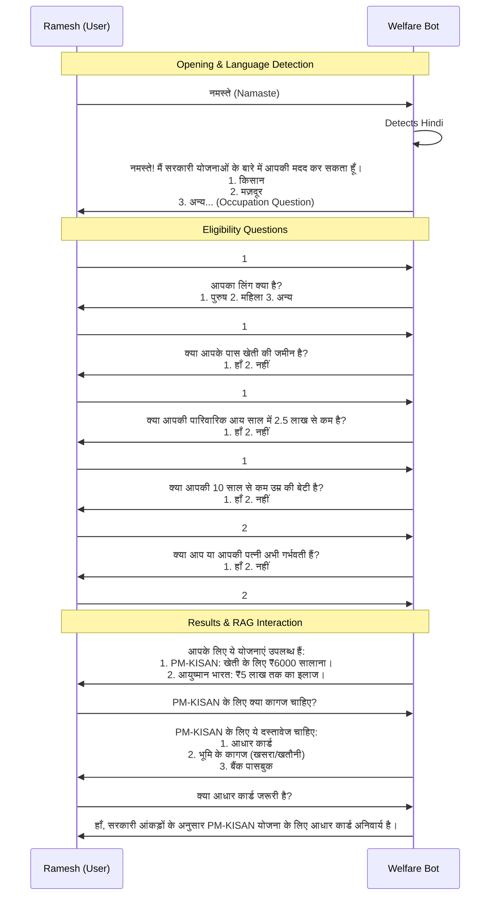
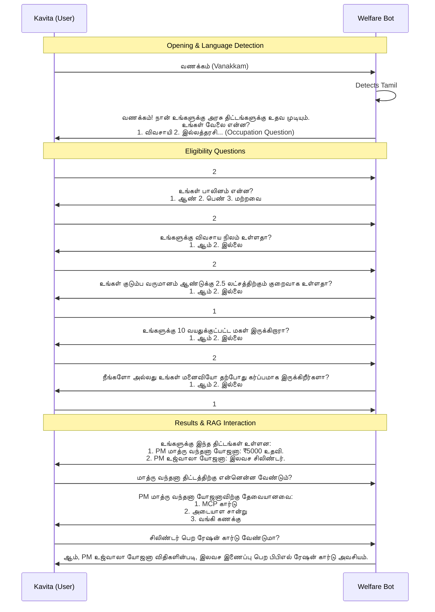
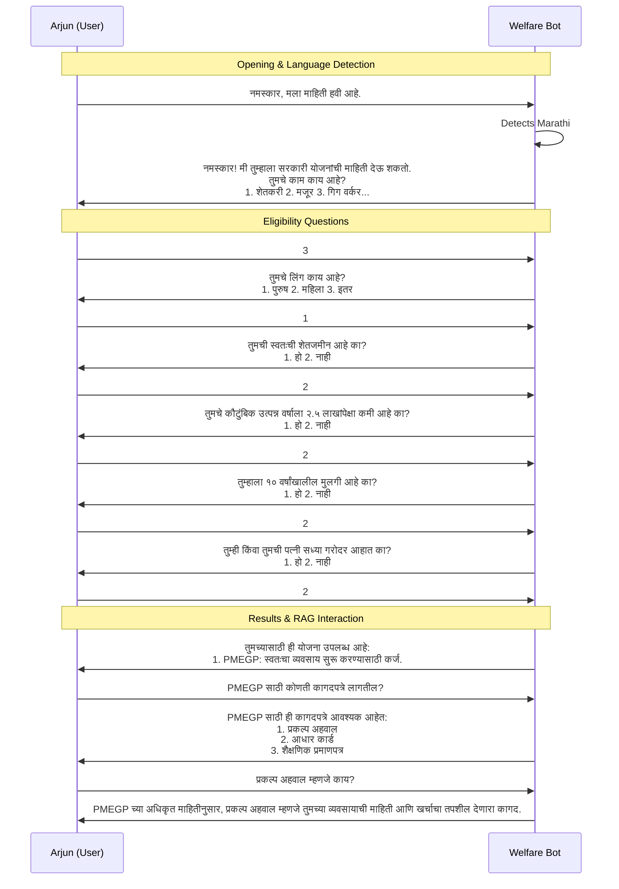

### Persona 1: Ramesh (UP Farmer, Hindi)

```mermaid
sequenceDiagram
    participant U as Ramesh (User)
    participant B as Welfare Bot

    Note over U,B: Opening & Language Detection
    U->>B: नमस्ते (Namaste)
    B->>B: Detects Hindi
    B->>U: नमस्ते! मैं सरकारी योजनाओं के बारे में आपकी मदद कर सकता हूँ।<br/>1. किसान<br/>2. मज़दूर<br/>3. अन्य... (Occupation Question)
    
    Note over U,B: Eligibility Questions
    U->>B: 1
    B->>U: आपका लिंग क्या है?<br/>1. पुरुष 2. महिला 3. अन्य
    U->>B: 1
    B->>U: क्या आपके पास खेती की जमीन है?<br/>1. हाँ 2. नहीं
    U->>B: 1
    B->>U: क्या आपकी पारिवारिक आय साल में 2.5 लाख से कम है?<br/>1. हाँ 2. नहीं
    U->>B: 1
    B->>U: क्या आपकी 10 साल से कम उम्र की बेटी है?<br/>1. हाँ 2. नहीं
    U->>B: 2
    B->>U: क्या आप या आपकी पत्नी अभी गर्भवती हैं?<br/>1. हाँ 2. नहीं
    U->>B: 2

    Note over U,B: Results & RAG Interaction
    B->>U: आपके लिए ये योजनाएं उपलब्ध हैं:<br/>1. PM-KISAN: खेती के लिए ₹6000 सालाना।<br/>2. आयुष्मान भारत: ₹5 लाख तक का इलाज।
    U->>B: PM-KISAN के लिए क्या कागज चाहिए?
    B->>U: PM-KISAN के लिए ये दस्तावेज चाहिए:<br/>1. आधार कार्ड<br/>2. भूमि के कागज (खसरा/खतौनी)<br/>3. बैंक पासबुक
    U->>B: क्या आधार कार्ड जरूरी है?
    B->>U: हाँ, सरकारी आंकड़ों के अनुसार PM-KISAN योजना के लिए आधार कार्ड अनिवार्य है।
```

### Persona 2: Kavita (Tamil Nadu, Pregnant, Tamil)

```mermaid
sequenceDiagram
    participant U as Kavita (User)
    participant B as Welfare Bot

    Note over U,B: Opening & Language Detection
    U->>B: வணக்கம் (Vanakkam)
    B->>B: Detects Tamil
    B->>U: வணக்கம்! நான் உங்களுக்கு அரசு திட்டங்களுக்கு உதவ முடியும்.<br/>உங்கள் வேலை என்ன?<br/>1. விவசாயி 2. இல்லத்தரசி... (Occupation Question)
    
    Note over U,B: Eligibility Questions
    U->>B: 2
    B->>U: உங்கள் பாலினம் என்ன?<br/>1. ஆண் 2. பெண் 3. மற்றவை
    U->>B: 2
    B->>U: உங்களுக்கு விவசாய நிலம் உள்ளதா?<br/>1. ஆம் 2. இல்லை
    U->>B: 2
    B->>U: உங்கள் குடும்ப வருமானம் ஆண்டுக்கு 2.5 லட்சத்திற்கும் குறைவாக உள்ளதா?<br/>1. ஆம் 2. இல்லை
    U->>B: 1
    B->>U: உங்களுக்கு 10 வயதுக்குட்பட்ட மகள் இருக்கிறாரா?<br/>1. ஆம் 2. இல்லை
    U->>B: 2
    B->>U: நீங்களோ அல்லது உங்கள் மனைவியோ தற்போது கர்ப்பமாக இருக்கிறீர்களா?<br/>1. ஆம் 2. இல்லை
    U->>B: 1

    Note over U,B: Results & RAG Interaction
    B->>U: உங்களுக்கு இந்த திட்டங்கள் உள்ளன:<br/>1. PM மாத்ரு வந்தனா யோஜனா: ₹5000 உதவி.<br/>2. PM உஜ்வாலா யோஜனா: இலவச சிலிண்டர்.
    U->>B: மாத்ரு வந்தனா திட்டத்திற்கு என்னென்ன வேண்டும்?
    B->>U: PM மாத்ரு வந்தனா யோஜனாவிற்கு தேவையானவை:<br/>1. MCP கார்டு<br/>2. அடையாள சான்று<br/>3. வங்கி கணக்கு
    U->>B: சிலிண்டர் பெற ரேஷன் கார்டு வேண்டுமா?
    B->>U: ஆம், PM உஜ்வாலா யோஜனா விதிகளின்படி, இலவச இணைப்பு பெற பிபிஎல் ரேஷன் கார்டு அவசியம்.
```

### Persona 3: Arjun (Pune Gig Worker, Marathi)

```mermaid
sequenceDiagram
    participant U as Arjun (User)
    participant B as Welfare Bot

    Note over U,B: Opening & Language Detection
    U->>B: नमस्कार, मला माहिती हवी आहे.
    B->>B: Detects Marathi
    B->>U: नमस्कार! मी तुम्हाला सरकारी योजनांची माहिती देऊ शकतो.<br/>तुमचे काम काय आहे?<br/>1. शेतकरी 2. मजूर 3. गिग वर्कर...
    
    Note over U,B: Eligibility Questions
    U->>B: 3
    B->>U: तुमचे लिंग काय आहे?<br/>1. पुरुष 2. महिला 3. इतर
    U->>B: 1
    B->>U: तुमची स्वतःची शेतजमीन आहे का?<br/>1. हो 2. नाही
    U->>B: 2
    B->>U: तुमचे कौटुंबिक उत्पन्न वर्षाला २.५ लाखांपेक्षा कमी आहे का?<br/>1. हो 2. नाही
    U->>B: 2
    B->>U: तुम्हाला १० वर्षांखालील मुलगी आहे का?<br/>1. हो 2. नाही
    U->>B: 2
    B->>U: तुम्ही किंवा तुमची पत्नी सध्या गरोदर आहात का?<br/>1. हो 2. नाही
    U->>B: 2

    Note over U,B: Results & RAG Interaction
    B->>U: तुमच्यासाठी ही योजना उपलब्ध आहे:<br/>1. PMEGP: स्वतःचा व्यवसाय सुरू करण्यासाठी कर्ज.
    U->>B: PMEGP साठी कोणती कागदपत्रे लागतील?
    B->>U: PMEGP साठी ही कागदपत्रे आवश्यक आहेत:<br/>1. प्रकल्प अहवाल<br/>2. आधार कार्ड<br/>3. शैक्षणिक प्रमाणपत्र
    U->>B: प्रकल्प अहवाल म्हणजे काय?
    B->>U: PMEGP च्या अधिकृत माहितीनुसार, प्रकल्प अहवाल म्हणजे तुमच्या व्यवसायाची माहिती आणि खर्चाचा तपशील देणारा कागद.
```
